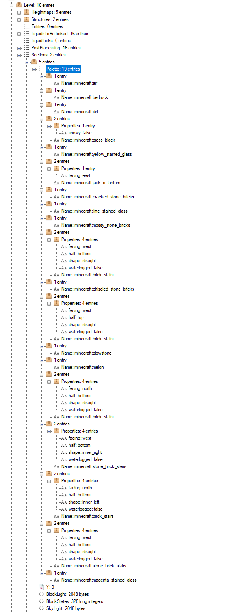

1.13 Update
###########

.. contents::

Block Format
------------

"Block Data" refers to information about a certain block. The two components of Block Data are
its **type** (e.g. air, grass, acacia door, etc.) and its **state**. Each type has a set
of **properties**. Each combination of all the type's properties
is a state, and has its own numerical ID.

Example:

.. code-block:: js

    "minecraft:light_gray_bed": {
        "properties": {
          "facing": [   // Possible values for the "facing" property
            "north",
            "south",
            "west",
            "east"
          ],
          "occupied": [ // Possible values for the "occupied" property
            "true",
            "false"
          ],
          "part": [     // Possible values for the "part" property
            "head",
            "foot"
          ]
        },
        "states": [
          {
            "properties": {
              "facing": "north",
              "occupied": "true",
              "part": "head"
            },
            "id": 876
          },
          {
            "properties": {
              "facing": "north",
              "occupied": "true",
              "part": "foot"
            },
            "id": 877
          },
          [...]
        ]
      }
    }

There are 2 ways to encode Block Data:

* Numerical IDs (type base ID + state bit mask)
* Map (type's  ``minecraft:...`` key + map of string:string for state)

On-Disk Block Storage
=====================

Each chunk section (16x16x16 blocks) has its own "Palette".
A Palette is a list of Block Data maps (see above). In NBT format, the ``Palette`` tag is a list of compounds.

This is an example palette for a section with 19 different block states:

The ``BlockStates`` tag is a Long Array. Each block is represented by a Palette index, corresponding to the order
of the section's Palette tag. All indices have the same bit size, corresponding to the size required
for the largest index (``ceil(log(n-1)/log(2))``, where ``n`` is the number of states in the Palette), with a minimum
of 4 bits per index.

The number of longs in the tag may grow from 256 longs (16 indices per long) to
as many longs as necessary to store all 4096 identically-sized indices.

Network Representation
======================

Similarly to the Disk Storage, a palette can be used to save bandwidth.
The palette is a list of integers (VarInt) -- the numerical IDs of each state used in the chunk.

Numerical IDs are incremental and start at 0 (``minecraft:air``). Contrary to previous Minecraft
versions, these IDs are not incremental per-type, but rather per-state.

For example, if type A has 2 properties with 2 possible values each, type A has 4 possible states.
If the first A state has ID 10, type B's states will start at 14.

**Encoding/Decoding Example**:

.. code-block:: js

    "minecraft:A": {
      "properties": {
        "foo": [
          "true",
          "false"
        ],
        "bar": [
          "true",
          "false",
          "maybe"
        ]
      },
      "states": [
        {
          "properties": {
            "foo": "true",
            "bar": "true"
          },
          "id": 10
        },
        {
          "properties": {
            "foo": "true",
            "bar": "false"
          },
          "id": 11
        },
        {
          "properties": {
            "foo": "true",
            "bar": "maybe"
          },
          "id": 12
        },
        {
          "properties": {
            "foo": "false",
            "bar": "true"
          },
          "id": 13
        },
        [...]
      ]
    }

Knowing the ID of the first state of a type, it is possible to encode and decode state properties
of a state from its index relative to the type's base ID.

Let's say we want to decode ID **12** back to the state's property map:

1. From a pre-calculated map, we can determine the base ID corresponding to 12 to be **10**.

2. The relative ID of the state is **2** (12-10). The binary representation of 2 is ``0010``.

3. The properties are decoded in reverse:

   i.  The ``bar`` property has 3 possible values; the largest index, 2, takes 2 bits.
       From right to left, the next 2 bits are read (``10``). Therefore, the value of the ``bar``
       property has index 2, which is "maybe".
   ii. The ``foo`` property has 2 possible values; the largest index, 1, takes 1 bit.
       From right to left, the next bit is read (``0``). Therefore, the value of the ``foo``
       property has index 0, which is "true".

Encoding is the same operation but in reverse; the base ID is added to the relative state ID (bit mask).
